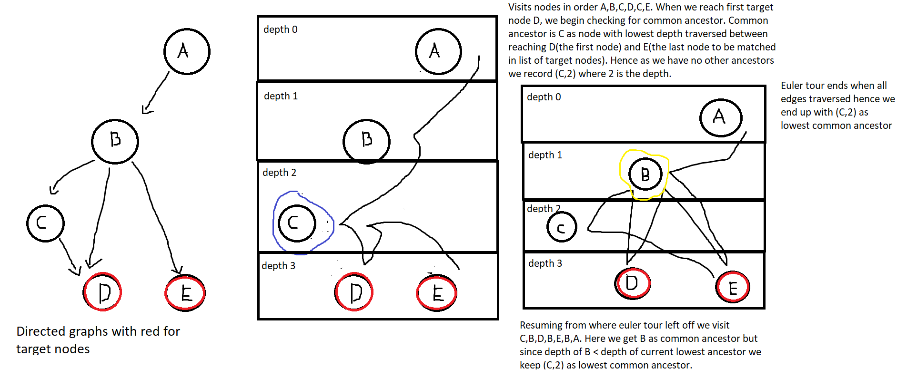

# softeng1

A repository for software engineering project 1

# Finding Lowest Common Ancestor of a Directed Acyclic Graph
Python code for a simple inefficient algorithm to find the lowest common ancestor of a list of target nodes of a directed acyclic graph. Graph represented by an adjacency list data structure using built in dictionaries and lists. 

# Performance
No properly measured or verifiable metric of performance since I can't be bothered. Estimated to run in O(VE) time where V is the number of vertices and E is the number of edges in graph as it runs an euler tour of entire graph. Uses O(N) space where N is the number of target nodes.

# Algorithm
Euler tour of entire graph where we store the common ancestor of the nodes with lowest depth find along the way. The node with the lowest depth found between the first match of a node in the nodelist and the last matched node is a common ancestor. The common ancestor with the greatest depth is the lowest common ancestor.


# API Reference
**Valid keys - All non-None values that implement \_\_eq\_\_() and \_\_hash\_\_()**

**Constructor**
Initialises an empty graph
```Python
    graph = new LCAGraph()
```
**edges(node)**
Returns all nodes it has a directed edge to in a list.
```Python
    children = graph.edges(1)
    children = graph.edges("source")
```

**add_node(node)**
Adds a new node to this graph based on the given key. Returns a boolean value of True or False depending on whether the node was sucessfully added. Fails for nodes that already exist in the graph and for invalid keys.
```Python
    sucess_bool = graph.add_node(0)
    sucess_bool = graph.add_node("root")
```

**add_edge(source_node, destination_node)**
Adds a directed edge between the source and destination nodes. Returns a boolean to indicate whether the operation failed or suceeded. Edges which create a cycle, source nodes that don't exist in the graph, invalid source or destination node keys and edges that already exist cause the operation to fail.
```Python
    sucess_bool = graph.add_edge(1,3)
    sucess_bool = graph.add_edge("source","dest")
```

**lowest_common_ancestor(root, nodelist)**
Finds the lowest common ancestor between the nodes in the nodelist. Uses the node passed in as root as source of graph, ie. evaluates subgraph rooted at root. Returns either None if no lowest common ancestor in subgraph or the first lowest common ancestor with greatest depth.
```Python
    lca = graph.lowest_common_ancestor(1,[4,5])
    lca = graph.lowest_common_ancestor("source",["dest1","dest2","dest3"])
```

# License
Code provided under a MIT license 
[License](./LICENSE)
